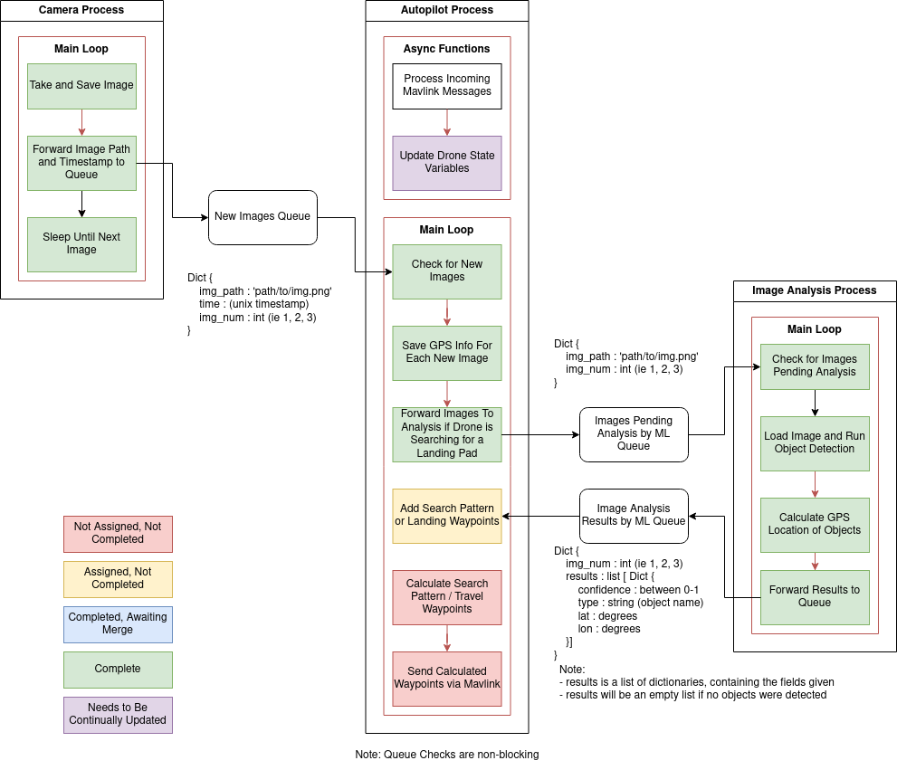

# Application Multiprocessing Structure

Shepard utilizes multiple processes to  handle tasks for achieving our drone tasks. These are created using python's multiprocessing library. These separate processes allow our onboard computer to simultaneously complete different time sensitive tasks. This important since we want to take images at a steady rate, monitor communication to the autopilot controller, and run inferences on our machine learning models.

## How does it work?

We have 3 separate tasks started by our main file, ```autopilot_main()```, ```image_capture_main()```, and ```inference_main()```. These functions each have a ```while True``` loop which continuously handles communications with the autopilot board, capturing images, and analyzing the images respectively.

To exchange data between tasks we use multiprocessing queues. These queues allow the programs to send data safely and without stopping any process.

## Diagram



Note: This was the only initial plan for the application. Please update as modifications are made